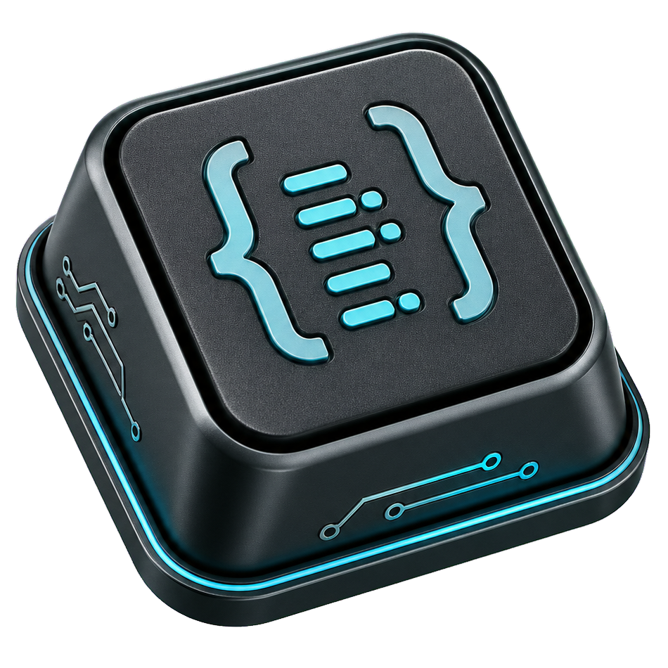

<p align="center"></p>
<h1 align="center">VK Code Show</h1>
<p align="center">View Windows key codes and copy VK tokens or scan codes.</p>
<p align="center"><a href="README.md">Русский</a> · <a href="https://github.com/Frommer-droid/VK-code-show/releases/latest">Latest release</a></p>

VK Code Show shows the most recent key pressed while its window is active.
It displays decimal and hexadecimal VK, scan code, Qt key, text and modifiers,
keeps a short history, and copies VK values, `{VKC:86}` tokens and scan codes.
It includes Russian Qt localization and automatic screen/DPI scaling with
a manual adjustment.

## Install and use

Download the installer from the [latest release](https://github.com/Frommer-droid/VK-code-show/releases/latest).
Install the application, focus its window and press `V`: VK `86`, hex `0x56`
and token `{VKC:86}` appear. The scan code depends on your keyboard.
Windows x64 is required; Python is not required for the packaged application.
Downloads require repository access while the repository is private.

## Run from source

Use Windows and Python 3.12 with a project environment:

```powershell
py -3.12 -m venv .venv
.\.venv\Scripts\python.exe -m pip install -r requirements.txt
.\.venv\Scripts\python.exe .\VK-code-show.py
```

The launcher attempts to switch to the project `.venv` if started with another Python.

## Development and build

```powershell
.\.venv\Scripts\python.exe -m pip install -r requirements-dev.txt
.\.venv\Scripts\python.exe -m unittest discover -s tests
.\.venv\Scripts\python.exe -m pytest
.\.venv\Scripts\python.exe -m ruff check .
.\.venv\Scripts\python.exe .\Build_Tools\build.py
```

The build uses a minimal native PATH, validates DLL origins and tests the frozen
runtime before moving the portable folder to `VK-code-show` at the project root.
It does not open the application interactively.

```powershell
Start-Process .\.venv\Scripts\pythonw.exe -WindowStyle Hidden -ArgumentList ".\00_CrRel.pyw"
Start-Process .\.venv\Scripts\pythonw.exe -WindowStyle Hidden -ArgumentList ".\00_Move.pyw"
```

The installer helper creates `VK-code-show_v<VERSION>_Setup.exe` on the Windows
Desktop. The default installation directory is `D:\Apps\VK-code-show`, with
a fixed-drive fallback and finally `C:\Apps\VK-code-show`.
See [DEVELOPER.md](DEVELOPER.md) for development and release details.

## Limitations and license

Capture requires the application window to be active; there is no global keyboard hook.
Settings are stored beside the application, so the directory must be writable.
The project's own code is [MIT licensed](LICENSE).
[Third-party components](THIRD_PARTY_NOTICES.md) retain their licenses.
